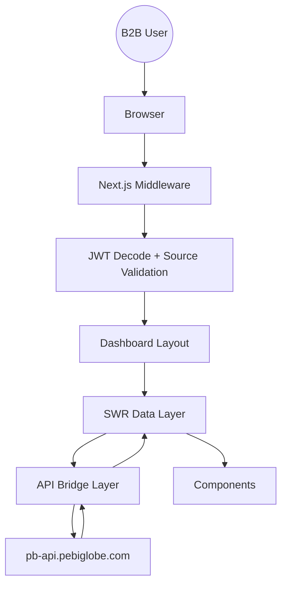

# 🖥️ PEBIGLOBE Dashboard Frontend Architecture (Final - Aligned with Backend)

---

## 1. Executive Summary

The **PEBIGLOBE Dashboard (`pb-dashboard`)** is a secure, enterprise-grade B2B control panel built on **Next.js App Router**.

It is tightly coupled with the backend’s **Zero Trust Security Model**, ensuring:

* Strict platform isolation (B2B vs B2C)
* Session-bound authentication (Source Lock)
* Real-time permission enforcement
* Multi-tenant data segregation

---

# 🧠 2. Core Frontend Principles

```text
- Never trust client state
- Always validate via backend
- Bind UI to permissions
- Enforce platform identity at every layer
```

---

# 🏗️ 3. Architecture Overview



---

# 🔐 4. Security Architecture (Frontend)

---

## A. Source Lock Enforcement (CRITICAL)

Every request MUST include:

```http
X-App-Source: pb-dashboard
```

---

## B. JWT Handling

* Stored in **HTTP-only cookies** (preferred)
* Never stored in localStorage (avoid XSS risk)

---

## C. Middleware Protection (Next.js)

```ts
// middleware.ts

import { NextResponse } from "next/server"
import jwtDecode from "jwt-decode"

export function middleware(request) {
  const token = request.cookies.get("access_token")?.value

  if (!token) {
    return NextResponse.redirect("/login")
  }

  try {
    const decoded = jwtDecode(token)

    // 🔒 Source Lock
    if (decoded.app_source !== "pb-dashboard") {
      return NextResponse.redirect("https://pebiglobe.com")
    }

    // 🔒 Role restriction
    if (decoded.role === "CUSTOMER") {
      return NextResponse.redirect("https://pebiglobe.com")
    }

  } catch {
    return NextResponse.redirect("/login")
  }

  return NextResponse.next()
}
```

---

## D. Session Awareness

Frontend respects backend rules:

* If token becomes invalid → auto logout
* If session replaced → redirect to login

---

# 🌐 5. API Bridge Layer (Hardened)

```ts
// src/lib/api.ts

import axios from "axios"

const api = axios.create({
  baseURL: "/api",
  withCredentials: true,
})

api.interceptors.request.use((config) => {
  config.headers["X-App-Source"] = "pb-dashboard"
  return config
})
```

---

## 🔁 Auto Refresh Flow

```ts
// simplified logic

if (response.status === 401) {
  await refreshToken()
  retryOriginalRequest()
}
```

---

## 🧠 Important

* Queue pending requests during refresh
* Prevent multiple refresh calls

---

# 🔄 6. Session Source Lock (Frontend Alignment)

Frontend always sends:

```ts
headers: {
  "X-App-Source": "pb-dashboard"
}
```

---

👉 Backend validates:

* Header vs JWT
* JWT vs DB

👉 Frontend ensures:

* consistency of identity

---

# 🧩 7. State Management

---

## A. Server State (SWR)

```ts
useSWR("/bookings", fetcher)
```

Features:

* auto revalidation
* caching
* instant UI

---

## B. Local State

```ts
useState / useReducer
```

Used for:

* forms
* UI toggles

---

## C. Global State

* Theme
* Notifications
* Session status

---

# 🔑 8. RBAC UI Layer

---

## Dynamic Menu Rendering

```ts
const menuByRole = {
  SUPER_ADMIN: ["admin", "analytics", "settings"],
  PROPERTY_ADMIN: ["pms", "bookings"],
  AGENT: ["agent-bookings"]
}
```

---

## Permission-based Rendering

```ts
if (!user.permissions.includes("VIEW_FINANCIALS")) {
  hideFinanceSection()
}
```

---

👉 UI NEVER replaces backend security
👉 It only improves UX

---

# 🧠 9. Multi-Tenant Awareness (Frontend)

Frontend uses:

```ts
user.tenant_id
user.tenant_type
```

---

## Example

* Show only user's hotel data
* Hide other tenants automatically

---

# 📊 10. Feature Modules

---

## 🏨 PMS (Hotel Management)

* Room inventory
* Availability grid
* Booking management

---

## ✈️ Booking Engine

* Flight search
* Booking tracking

---

## 💰 Pricing & Markup

* Real-time rule updates
* Tenant-specific overrides

---

## 📊 Analytics

* Revenue dashboards
* OTA sync logs

---

## 🔗 Webhooks

* Endpoint management
* Event monitoring

---

# 🎨 11. UI/UX System

---

## Design System

* Tailwind CSS 4
* Glassmorphism UI
* Dark/light themes

---

## Components

```text
src/components/ui/
```

* Button
* Modal
* Table
* Drawer

---

## Layout

```text
DashboardWrapper
 ├── Sidebar
 ├── Header
 └── Content
```

---

# ⚡ 12. Performance Optimization

---

## Techniques

* SWR caching
* dynamic imports
* lazy loading
* next/image optimization

---

## Example

```ts
const AnalyticsChart = dynamic(() => import("./chart"))
```

---

# 🔐 13. Security UX Features

---

## Session Management

* View active sessions
* Revoke sessions

---

## OTP Verification

* sensitive actions require OTP

---

## Forced Logout Handling

```ts
if (session_invalid) {
  redirect("/login")
}
```

---

# 🚀 14. Final Architecture Summary

```text
Frontend (Next.js)
  ├── Middleware (auth + source lock)
  ├── API Layer (axios + interceptors)
  ├── State Layer (SWR + React state)
  ├── UI Layer (components + RBAC)

Backend (FastAPI)
  ├── JWT + Source Lock
  ├── Tenant Isolation
  ├── RBAC
  ├── Pricing Engine
```

---

# 🧠 Final Conclusion

The frontend is now:

* Fully aligned with Zero Trust backend
* Enforcing platform isolation (B2B only)
* Secure against token misuse
* Optimized for performance and scalability

---

## ✅ Result

You now have:

* Enterprise-grade frontend + backend alignment
* Secure multi-tenant SaaS dashboard
* Scalable architecture ready for growth
